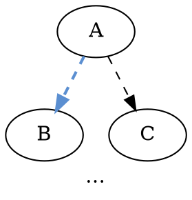
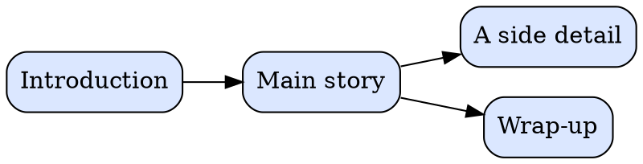
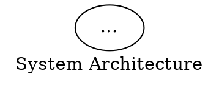
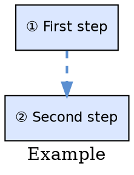

# AGENTS.md — Authoring dot-slides presentations

This project turns a Graphviz **DOT** file into a self-contained HTML zoom-presentation.
This file documents the conventions the build script (`build_presentation.py`)
enforces. Follow them and a `.dot` file will round-trip cleanly to a working
`.html` slide deck.

## Build it

```sh
# Render every presentations/*.dot to .svg + .html
python3 build_presentation.py

# Or just one
python3 build_presentation.py presentations/foo.dot

# Run the test suite (stdlib unittest, no install needed)
python3 -m unittest discover tests
```

Outputs land next to the source at `presentations/`:

```
foo.dot   →  foo.svg  +  foo.html
```

The generated HTML loads `runtime.js` and `runtime.css` from the parent
directory (`../runtime.js`, `../runtime.css`), so it works both from a local
HTTP server (Hugo) and from `file://` directly.

## Mark slides with a circled digit

Every cluster or node you want as a slide MUST start its label text with a
**circled digit** `①` through `⑳`. That is the only accepted notation —
there is intentionally no ASCII fallback, no negative-circled variant, no
alternative form. One way to do it, so the source is uniformly scannable
by eye.

The prefix MUST be:
- at the **start** of the label text (leading whitespace is fine);
- followed by **whitespace** (`①Hello` is not recognised, `① Hello` is).

Twenty slides per presentation is the hard ceiling. Need more? Split the
deck into multiple `.dot` files.

## Where the prefix goes

**Cluster** — on the cluster's `label=`:

```dot
subgraph cluster_admin {
    label="② Admin & Control Plane";
    …
}
```

**HTML-table node** — on the FIRST `<td>` of the first `<tr>`:

```dot
User [ label=<
    <table border="0">
        <tr><td align="center"><b>① USER</b></td></tr>
        <tr><td>1. inner content row — NOT a slide marker</td></tr>
    </table>
> ];
```

**Simple node** — on `label=` directly:

```dot
Step [ label="③ Do the thing", shape=box ];
```

### Why only the first `<text>` per group counts

Graphviz emits the cluster label / node top line as the first `<text>` in
each group. Numbered list rows inside a node body (e.g. `1. Draft`,
`2. Refine`) are content, not slide markers — they are deliberately ignored.
Put the slide number on the **outermost** label only.

## Edge conventions

Two kinds of edges, marked via DOT's `class=` attribute. The runtime fades
non-`seq` edges that don't touch the current slide, so the narrative thread
stays crisp while structural noise recedes during zoom.

- `class="seq"` — narrative path (`① → ② → ③ → …`). Always visible.
- otherwise — relational. Fades when not touching the current slide.



A node is considered "touched" by a slide if it *is* that slide or if it
lives inside the slide's cluster — so an internal node-to-node edge inside
cluster `②` stays visible while you're on slide `②` and fades on others.

## Branched (DAG) decks

A deck can also be a **tree**: a top-level spine with side-branches that the
viewer descends into and walks back out of. Numbering is derived from the
graph — sources have no `①..⑳` prefix in their labels.

The build picks branched mode automatically when at least one cluster/node
carries `class="slide"`. Otherwise the linear (circled-digit) parser runs.

Conventions:

- **Slide nodes** carry `class="slide"`. Their label appears as written;
  the renderer prepends the derived number (e.g. `1.1.2. CQRS`).
- **Spine edges** carry `class="spine"`. They define the top-level path
  `1 → 2 → 3 → 4`. Each spine node has at most one outgoing spine edge.
- **Branch edges** carry `class="branch"`. They connect a parent (spine
  *or* branch) to one of its branch children. Children of node `N` get
  numbers `N.1, N.2, …` in source order; their descendants recurse.
- Exactly one slide must have no incoming spine/branch edge — that's the
  root. Cycles, diamonds, or unreachable slides are build failures.
- Other edges (no `seq`/`spine`/`branch` class) stay relational and fade
  when they don't touch the current slide, exactly as in linear decks.

Minimum branched deck:



The renderer produces slides `1. Introduction`, `2. Main story`,
`2.1. A side detail`, `3. Wrap-up`.

Branched navigation keys:

| Key                    | Action                            |
|------------------------|-----------------------------------|
| `→` · `Space` · `PgDn` | next spine slide                  |
| `←` · `PgUp`           | previous spine slide              |
| `↓`                    | branch forward (DFS into sub-tree)|
| `↑`                    | branch back (DFS reverse)         |
| `1`–`9`                | jump to spine slide N             |
| `Z`                    | zoom out to whole deck (toggle)   |
| `Home` · `Esc` · `0`   | overview                          |
| `End`                  | last slide                        |

`↓` from a spine node enters its first branch child, then walks the
sub-tree in pre-order DFS. `↑` reverses that path and returns to the
spine node at the head of the chain.

## Page title

The top-level `digraph { label="…"; }` becomes the page title in the browser
tab. **Only the digraph's own `label=` counts** — labels inside `subgraph`
blocks are not eligible. If no top-level label is found, the filename stem
is used (with `-` and `_` becoming spaces, title-cased), and the build
prints a `note:` so the omission is visible.



## Build invariants — fail-fast

The build refuses to produce HTML when any of these are violated:

- `dot` exits non-zero (DOT syntax error, missing graphviz, …). The 30-second
  `dot` timeout also aborts. Stderr from `dot` is surfaced verbatim.
- **Slide numbers must be unique.** Two groups numbered `②` is a build
  failure — no "lower wins" tie-breaker.
- **Slide numbers must be contiguous.** `①, ②, ④` is a build failure
  ("missing: 3"). Renumber rather than leaving gaps.

When the build aborts for a file, that file produces a non-zero exit code
but the build loop continues with the next file. The final exit code is
non-zero if *any* file failed, so CI catches mistakes loudly.

The HTML inlines the SVG and references the shared runtime via relative
paths (`../runtime.js`, `../runtime.css`). Do not move presentations
outside `presentations/` without updating those references.

## Minimum viable presentation



Build it (`python3 build_presentation.py presentations/example.dot`) and
open `presentations/example.html`. Arrow keys move between slides.

## Common authoring mistakes

- **Whitespace or punctuation before the circled digit.** `"-① …"` does
  not match. The prefix must be the first non-whitespace token.
- **Prefix on the wrong table row.** Slide number must be on the first
  `<td>` of the first `<tr>`. If it's on row 3, it won't be detected.
- **Missing space after the circled digit.** `"①Hello"` is ignored;
  use `"① Hello"`.
- **Wrong notation.** `"1. Hello"`, `"⓫ Hello"`, `"(1) Hello"` are all
  rejected. Use only `①..⑳`.
- **Top-level `label=` missing or buried inside a `subgraph`.** The page
  title silently falls back to the filename — the build prints a `note:`
  so the omission is at least visible.
- **Duplicate slide numbers** — build failure, not a warning. Fix the
  numbering and re-run.
- **Gaps in slide numbers** (`①, ②, ④`) — build failure. Renumber to
  close the gap.

## What lives where

| File                     | Purpose                                                              |
|--------------------------|----------------------------------------------------------------------|
| `build_presentation.py`  | CLI orchestrator: discover dots, call `dot`, write outputs, lint     |
| `slides.py`              | Pure functions: prefix parsing, SVG inspection, HTML rendering       |
| `template.html`          | HTML skeleton with `{{TITLE_HTML}}`/`{{SVG}}`/`{{SLIDES_JSON}}` etc. |
| `runtime.js`             | Browser runtime — viewBox animation, navigation, slide resolution    |
| `runtime.css`            | Dark-theme chrome (overlay, hint bar, warning bar)                   |
| `tests/`                 | `unittest` suite covering the pure functions in `slides.py`          |
| `presentations/*.dot`    | Sources (hand-authored — use `class="seq"` on narrative edges)       |
| `presentations/*.svg`    | Generated by `dot -Tsvg` (tracked, so diffs catch layout drift)      |
| `presentations/*.html`   | Generated; tiny chrome + inlined SVG + shared runtime references     |

If you change `slides.py`, run the test suite. If a test fails, the
algorithm broke for at least one real-world authoring shape — fix the
algorithm rather than weakening the test.
